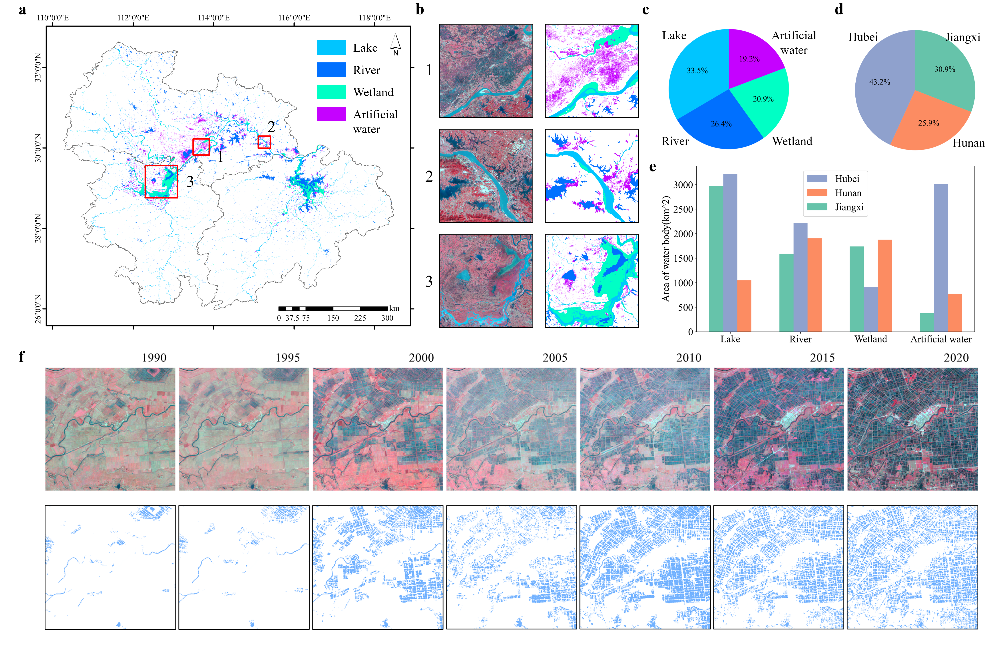

# Water-MRYR

The code for the mapping of multiple types of water body in the Middle Reaches of the Yangtze River(MRYR).

Our mapping products could be downloaded from science data bank:https://doi.org/10.57760/sciencedb.12990

The semantic segmentation dataset used in this study will be released soon. If you have any questions please contact mahz@cug.edu.cn.

If you find anything helpful, please cite the following:

@misc{ 65b7dbde236248b69df4c7d8433de8d8,
  author       = {Haozheng Ma and Lizhe Wang and Xiaohong Yang and Runyu Fan and Kang He},
  title        = {{Prolonged Water-Body Types Dataset of Urban Agglomeration in Central China(1990-2021)}},
  year         = 2024,
  month        = nov,
  publisher    = {Science Data Bank},
  version      = {V2},
  doi          = {10.57760/sciencedb.12990},
  url          = https://doi.org/10.57760/sciencedb.12990
}
